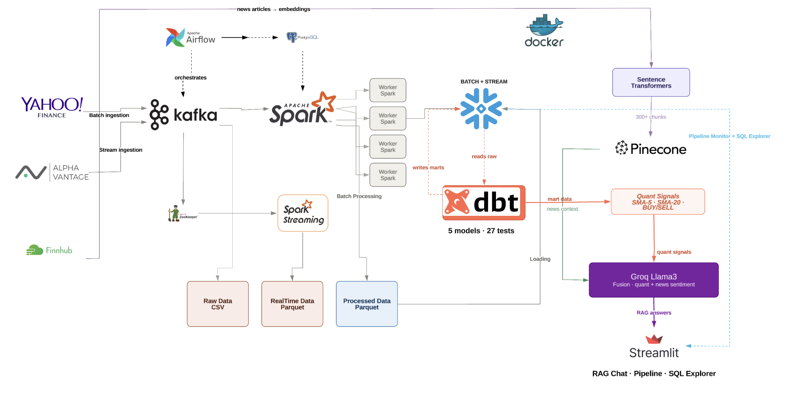
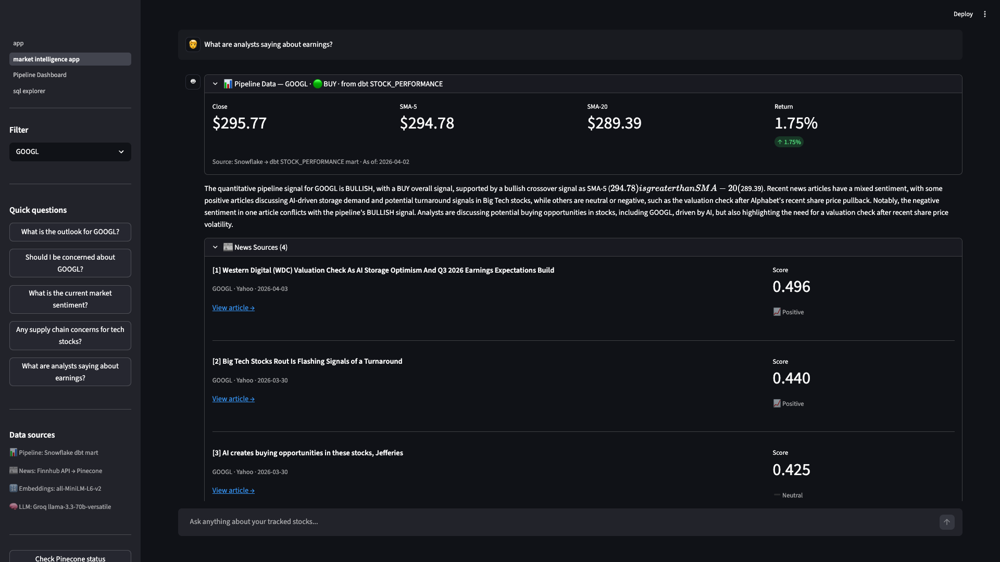
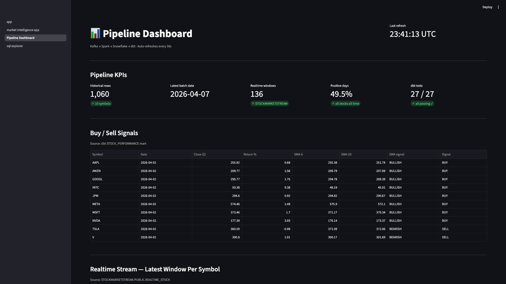
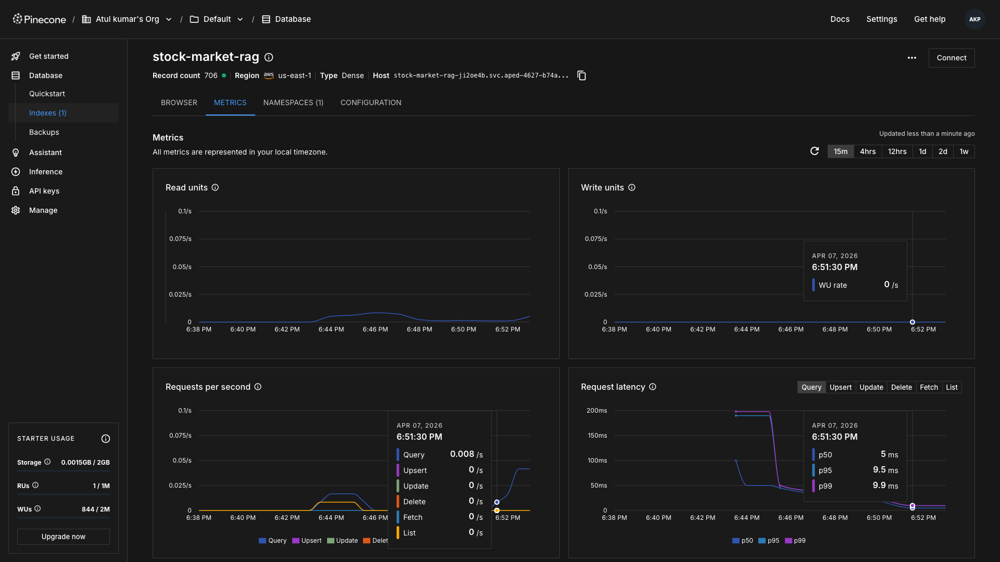

<div align="center">

# Stock Market Intelligence Pipeline

**A production-grade data engineering system that ingests, transforms, and analyses stock market data — then answers natural language questions about it using AI grounded in your own pipeline's output.**

[](https://github.com/atulpandey02/stock-market-rag-pipeline/actions)
[](https://python.org)
[](https://kafka.apache.org)
[](https://spark.apache.org)
[](https://airflow.apache.org)
[](https://snowflake.com)
[](https://getdbt.com)
[](https://docker.com)
[](https://pinecone.io)
[](https://groq.com)
[](https://min.io)

<br/>

**10 Docker containers &nbsp;·&nbsp; 2 Airflow DAGs &nbsp;·&nbsp; 5 dbt models &nbsp;·&nbsp; 27 data quality tests &nbsp;·&nbsp; 300+ Pinecone chunks &nbsp;·&nbsp; 10 stocks tracked**

<br/>

> *Tracks 10 major equities — AAPL · MSFT · GOOGL · AMZN · META · TSLA · NVDA · INTC · JPM · V*

</div>

---

## Table of Contents

- [How It Works](#how-it-works)
- [What Makes This Different](#what-makes-this-different)
- [Architecture](#architecture)
- [Pipeline in Action](#pipeline-in-action)
- [Tech Stack](#tech-stack)
- [Infrastructure](#infrastructure)
- [Project Structure](#project-structure)
- [Data Flow](#data-flow)
- [Snowflake Schema](#snowflake-schema)
- [dbt Quality Gates](#dbt-quality-gates)
- [CI/CD Pipeline](#cicd-pipeline)
- [Key Engineering Decisions](#key-engineering-decisions)
- [Lessons Learned](#lessons-learned)
- [Getting Started](#getting-started)
- [Future Enhancements](#future-enhancements)

---

## How It Works

A 6-step end-to-end flow from raw market data to AI-grounded answers:

```
1. Airflow triggers daily  →  Kafka ingests OHLCV history from Finnhub API
2. Spark computes          →  SMA-5, SMA-20, daily returns, BUY/SELL signals
3. Snowflake stores        →  everything via idempotent MERGE (no duplicates on retry)
4. dbt transforms          →  raw tables into analytical marts (27 tests gate every run)
5. Pinecone stores         →  300+ Finnhub news embeddings for semantic retrieval
6. Groq Llama3 fuses       →  dbt quantitative signals + Pinecone news into grounded answers
```

---

## What Makes This Different

Most RAG projects pull from a static document store. This one is different — **the AI answers are grounded in data your pipeline computed**.

When you ask *"Should I buy AAPL?"* the system:

1. Queries the `STOCK_PERFORMANCE` dbt mart for the latest SMA crossover signal
2. Retrieves the 5 most semantically relevant news chunks from Pinecone
3. Feeds both into Groq Llama3 — if the quantitative signal conflicts with news sentiment, the model flags it explicitly

```
📊 Pipeline Data — AAPL · 🟢 BULLISH · from dbt STOCK_PERFORMANCE
   Close: $255.92  |  SMA-5: $255.38  |  SMA-20: $251.74  |  Return: +0.68%

"The pipeline signal is BULLISH with SMA-5 above SMA-20 — a classic
bullish crossover. Recent news has mixed sentiment however, with analysts
at Evercore maintaining a $330 price target but broader market concerns
flagged by multiple sources. The conflicting signals warrant caution..."
```

This is also a Lambda architecture portfolio project — batch and streaming run simultaneously into two separate Snowflake databases, with a custom `MinIODataSensor` validating data landing before Spark ever runs.

---

## Architecture

<div align="center">
  
</div>

<br/>

The system runs two parallel pipelines that converge at the intelligence layer:

- **Batch pipeline** — fetches a full year of OHLCV history daily via Finnhub, processes it through Spark, loads into Snowflake via MERGE, and runs dbt transformations to produce BUY/SELL signals
- **Streaming pipeline** — generates real-time price ticks every 30 seconds, computes 3-minute and 5-minute windowed aggregations via Spark Streaming, loads into a separate Snowflake database
- **Intelligence layer** — the RAG engine synthesises **both** quantitative pipeline signals from dbt **and** financial news from Pinecone to answer natural language questions — the answer is only as good as your pipeline

---

## Pipeline in Action

### Orchestration — Airflow DAGs

<div align="center">
  <table>
    <tr>
      <td align="center" width="50%">
        
        <br/><sub><b>Batch pipeline — all 6 tasks green</b></sub>
      </td>
      <td align="center" width="50%">
        
        <br/><sub><b>Streaming pipeline — all 8 tasks green</b></sub>
      </td>
    </tr>
  </table>
</div>

### Intelligence Layer — Streamlit Dashboard

<div align="center">
  
  <br/><sub><b>Page 1 — RAG chat grounded in live dbt pipeline signals</b></sub>
</div>

<br/>

> The dashboard has three pages. **Page 1** is the RAG chat — it shows the quantitative BUY/SELL signal from the `STOCK_PERFORMANCE` dbt mart alongside retrieved Pinecone news chunks before generating a Groq Llama3 response, and explicitly flags when quantitative and sentiment signals conflict. **Page 2** queries Snowflake directly for live ingestion stats and pipeline health. **Page 3** is a SQL explorer for ad-hoc queries against both `STOCKMARKETBATCH` and `STOCKMARKETSTREAM` databases.

<div align="center">
  
  <br/><sub><b>Page 2 — live pipeline monitor querying Snowflake directly</b></sub>
</div>

### Data Quality — dbt Lineage + Pinecone Index

<div align="center">
  <table>
    <tr>
      <td align="center" width="50%">
        
        <br/><sub><b>dbt — model lineage and 27 passing tests</b></sub>
      </td>
      <td align="center" width="50%">
        
        <br/><sub><b>Pinecone — 300+ embedded financial news chunks</b></sub>
      </td>
    </tr>
  </table>
</div>

---

## Tech Stack

| Layer | Technology |
|---|---|
| Message broker | Apache Kafka — dual topics (`batch-stock-data` + `realtime-stock-data`) |
| Data lake | MinIO — Hive-partitioned `year=/month=/day=/symbol=` |
| Processing | Apache Spark 3.5.1 — batch transforms + windowed aggregations |
| Warehouse | Snowflake — two databases, incremental MERGE loading |
| Transformation | dbt — 5 models, 27 automated quality tests |
| Orchestration | Apache Airflow 2.9.3 — custom MinIO sensors, retry logic |
| Vector DB | Pinecone — 300+ embedded financial news chunks |
| Embeddings | sentence-transformers/all-MiniLM-L6-v2 — 384-dim, free, local |
| LLM | Groq Llama3-8b — grounded financial Q&A |
| UI | Streamlit — 3-page dashboard (RAG chat, pipeline monitor, SQL explorer) |
| Infrastructure | Docker Compose — 9 containerised services |
| CI/CD | GitHub Actions — syntax checks, unit tests, dbt validation |

---

## Infrastructure

### Docker Services (9 containers)

| Service | Role |
|---|---|
| `zookeeper` | Kafka cluster coordination |
| `kafka` | Message broker — batch and realtime topics |
| `spark-master` | Spark cluster manager |
| `spark-worker-1` / `spark-worker-2` | Distributed compute nodes |
| `airflow-webserver` | DAG UI at localhost:8080 |
| `airflow-scheduler` | DAG trigger and task queue |
| `minio` | S3-compatible data lake at localhost:9001 |
| `postgres` | Airflow metadata database |

### Kafka Topics

| Topic | Producer | Consumer | Destination |
|---|---|---|---|
| `batch-stock-data` | `batch_data_producer.py` | `batch_data_consumer.py` | `MinIO raw/historical/` |
| `realtime-stock-data` | `stream_data_producer.py` | `realtime_data_consumer.py` | `MinIO raw/realtime/` |

---

## Project Structure

```
stockmarketdatapipeline/
│
├── docker-compose.yaml
├── requirements.txt
├── .env.example                              ← copy to .env and fill credentials
├── .gitignore
│
├── docs/images/                              ← all screenshots for this README
│
├── src/
│   │
│   ├── kafka/
│   │   ├── producer/
│   │   │   ├── batch_data_producer.py        ← Finnhub OHLCV → Kafka
│   │   │   └── stream_data_producer.py       ← price ticks → Kafka
│   │   └── consumer/
│   │       ├── batch_data_consumer.py        ← Kafka → MinIO raw/historical/
│   │       └── realtime_data_consumer.py     ← Kafka → MinIO raw/realtime/
│   │
│   ├── spark/jobs/
│   │   ├── spark_batch_processor.py          ← SMA-5/20, returns, daily range
│   │   ├── spark_stream_processor.py         ← always-on structured streaming
│   │   └── spark_stream_batch_processor.py   ← 3-min/5-min windowed aggregations
│   │
│   ├── snowflake/
│   │   ├── load_to_snowflake.py              ← historical → Snowflake MERGE
│   │   └── load_stream_to_snowflake.py       ← realtime → Snowflake MERGE
│   │
│   ├── dbt/
│   │   ├── models/
│   │   │   ├── staging/                      ← stg_historical_stock, stg_realtime_stock
│   │   │   └── marts/                        ← stock_daily_metrics, stock_performance
│   │   └── tests/                            ← 4 custom SQL data quality tests
│   │
│   ├── rag/
│   │   ├── rag_pipeline.py                   ← Finnhub news → Pinecone ingestion
│   │   ├── app.py                            ← Streamlit entry point
│   │   └── pages/
│   │       ├── 1_Market_Intelligence.py      ← RAG chat + dbt metrics card
│   │       ├── 2_Pipeline_Dashboard.py       ← live Snowflake monitoring
│   │       └── 3_SQL_Explorer.py             ← ad-hoc SQL queries
│   │
│   └── airflow/dags/
│       ├── stock_market_batch_dag.py         ← 6-task batch orchestration
│       ├── stock_market_stream_dag.py        ← 8-task stream orchestration
│       └── scripts/                          ← script copies for Airflow workers
│
├── tests/
│   └── unit_tests.py
│
└── .github/workflows/
    └── ci.yml                                ← syntax checks, unit tests, dbt parse
```

---

## Data Flow

### Batch (runs daily via Airflow)
```
Finnhub API  →  Kafka  →  MinIO raw/historical/
             →  Spark (SMA-5, SMA-20, daily_return_pct, is_positive_day)
             →  MinIO processed/historical/
             →  Snowflake HISTORICAL_STOCK  (MERGE on symbol + date)
             →  dbt run  → stg_historical_stock
                         → stock_daily_metrics
                         → stock_performance  ← BUY/SELL signals
             →  dbt test → 27 checks pass or pipeline fails
```

### Streaming (continuous via Airflow)
```
Price generator  →  Kafka  →  MinIO raw/realtime/
                 →  Spark windowed aggregations (3-min, 5-min MA)
                 →  Snowflake REALTIME_STOCK  (MERGE on symbol + window_start)
```

### Intelligence (on demand via Streamlit)
```
User question
  →  Snowflake STOCK_PERFORMANCE  (dbt BUY/SELL signal, SMA crossover)
  →  Pinecone semantic search      (top 5 relevant news chunks)
  →  Groq Llama3                   (synthesises both, flags conflicts)
  →  Streamlit                     (answer + metrics card + sources)
```

---

## Snowflake Schema

**STOCKMARKETBATCH.PUBLIC.HISTORICAL_STOCK**

| Column | Type | Description |
|---|---|---|
| symbol | STRING | Stock ticker |
| date | DATE | Trading date |
| open_price / close_price | FLOAT | OHLC prices |
| daily_return_pct | FLOAT | `(close - open) / open × 100` |
| daily_range | FLOAT | `high - low` |
| is_positive_day | BOOLEAN | `close > open` |
| sma_5 / sma_20 | FLOAT | Moving averages computed by Spark |

**STOCKMARKETSTREAM.PUBLIC.REALTIME_STOCK**

| Column | Type | Description |
|---|---|---|
| symbol | STRING | Stock ticker |
| window_start | TIMESTAMP | Aggregation window start |
| ma_3m / ma_5m | FLOAT | Windowed moving averages |
| volatility_3m / volatility_5m | FLOAT | Price std deviation per window |
| volume_sum_3m / volume_sum_5m | BIGINT | Volume per window |

---

## dbt Quality Gates

27 tests run after every pipeline execution. Any failure stops the pipeline before bad data reaches consumers.

```sql
-- Built-in dbt tests
not_null           → symbol, date, close_price, volume
accepted_values    → symbol in 10 tracked stocks only

-- Custom SQL tests
assert_high_gte_low        → high_price >= low_price always
assert_price_not_negative  → close_price > 0 always
assert_no_future_dates     → date <= current_date always
assert_expected_symbols    → exactly 10 stocks, no drift
```

---

## CI/CD Pipeline

Five jobs run on every push to `main` or `develop` via GitHub Actions:

| Job | What it checks |
|---|---|
| Python Syntax Check | All `.py` files in `src/` parse without errors |
| Unit Tests | RAG pipeline logic — no Kafka, MinIO, or Snowflake needed |
| dbt Structure Validation | All required model and test files exist, `dbt parse` validates SQL |
| Airflow DAG Validation | Both DAGs import cleanly with dummy env vars |
| Project Structure Check | All expected files present, `.env` not committed |

---

## Key Engineering Decisions

**Why MERGE instead of INSERT?**
Idempotency — if Airflow retries a failed task, MERGE updates existing rows instead of creating duplicates. Critical for production pipelines where task reruns are expected.

**Why custom MinIO sensor instead of time-based wait?**
A time-based sleep is fragile. The custom `MinIODataSensor` polls every 30 seconds and only unblocks Spark when files are confirmed present — preventing silent failures on empty partitions.

**Why `datetime.now(UTC)` in the sensor instead of `context['ds']`?**
Airflow's `ds` is the logical schedule date — when you manually trigger a DAG it lags behind the actual date. Files written by the consumer use real UTC time, so the sensor must match that.

**Why sentence-transformers instead of OpenAI embeddings?**
Free, runs locally, no API key, no rate limits. `all-MiniLM-L6-v2` at 384 dimensions is fast on CPU and sufficient for financial news retrieval.

**Why separate Snowflake databases for batch and stream?**
Different update patterns and SLAs. Batch loads once daily with full MERGE semantics. Stream loads every few minutes with window-based keys. Separating them prevents schema conflicts and makes access control simpler.

---

## Lessons Learned

> These are real bugs hit during development — each one taught something about production data engineering that no tutorial covers.

| Problem | Root Cause | Fix |
|---|---|---|
| Silent data loss in Snowflake | UTC/EST timezone mismatch — consumer wrote `day=29`, Spark read `day=28` | Standardised everything to explicit `datetime.now(timezone.utc)` |
| MinIO sensor checking wrong date | `context['ds']` returns logical schedule date, not trigger date | Changed sensor to use `datetime.now(UTC)` directly |
| Kafka consumer crashes on startup | `group.id=None` — env var missing from docker-compose | Added `KAFKA_GROUP_BATCH_ID` to `x-airflow-common` |
| Spark `PATH_NOT_FOUND` | `recursiveFileLookup` treated single CSV as directory | Switched to glob pattern |
| Streamlit credentials not found | `find_dotenv(usecwd=True)` starts from CWD not file location | Walk up from `Path(__file__)` instead |
| dbt alias conflict | `context['ds']` undefined in `run_spark_processing` | Restored the assignment and replaced `now` references with `ds` |

---

## Getting Started

> Full setup takes approximately 15–20 minutes including Docker pulling all images.

### Prerequisites

All external services below have free tiers — no credit card required for Finnhub, Pinecone, or Groq.

| Requirement | Where to get it |
|---|---|
| Docker Desktop | [docker.com/products/docker-desktop](https://docker.com/products/docker-desktop) |
| Snowflake account | [snowflake.com](https://snowflake.com) — free 30-day trial |
| `FINNHUB_API_KEY` | [finnhub.io](https://finnhub.io) — free tier |
| `PINECONE_API_KEY` | [app.pinecone.io](https://app.pinecone.io) — free starter plan |
| `GROQ_API_KEY` | [console.groq.com](https://console.groq.com) — free tier |

### Environment Variables

Copy `.env.example` to `.env` and fill in the following:

| Variable | Description |
|---|---|
| `SNOWFLAKE_ACCOUNT` | Account identifier from Snowflake console — e.g. `abc12345.us-east-1` |
| `SNOWFLAKE_USER` | Your Snowflake username |
| `SNOWFLAKE_PASSWORD` | Your Snowflake password |
| `SNOWFLAKE_WAREHOUSE` | Warehouse name — default `COMPUTE_WH` |
| `FINNHUB_API_KEY` | Finnhub API key for OHLCV history and news |
| `PINECONE_API_KEY` | Pinecone API key for vector storage and search |
| `GROQ_API_KEY` | Groq API key for Llama3 inference |

### Run It

```bash
# 1. Clone
git clone https://github.com/atulpandey02/stock-market-rag-pipeline.git
cd stock-market-rag-pipeline

# 2. Configure
cp .env.example .env
# Fill in your credentials — see the table above

# 3. Start all 9 Docker services
docker-compose up -d

# 4. Trigger batch pipeline
# Open Airflow UI → http://localhost:8080  (admin / admin)
# Find stock_market_batch_pipeline → click ▶ Trigger

# 5. Set up dbt virtual environment (first time only)
python -m venv dbt_venv
source dbt_venv/bin/activate        # Windows: dbt_venv\Scripts\activate
pip install dbt-core dbt-snowflake

# 6. Run dbt transformations (local terminal — not inside Docker)
cd src/dbt
source ../../dbt_venv/bin/activate
dbt run --profiles-dir . --project-dir .
dbt test --profiles-dir . --project-dir .

# 7. Ingest news and launch the dashboard
cd src/rag
python rag_pipeline.py     # fetches Finnhub news and loads into Pinecone (~2 min)
streamlit run app.py       # opens dashboard at http://localhost:8501
```

---

## Future Enhancements

- **Snowpipe auto-ingestion** — replace Airflow trigger with Snowpipe watching MinIO via webhook for true event-driven loading
- **Near-realtime dbt** — run dbt every 15 minutes on `REALTIME_STOCK` so RAG answers incorporate short-term momentum alongside daily trends
- **Unified RAG context** — inject both `STOCK_PERFORMANCE` (daily SMA) and `REALTIME_STOCK` (3-min MA) into the prompt with explicit timestamp labelling so the model can reason about momentum across timeframes
- **Anomaly detection** — flag unusual price movements via Z-score alerts through Airflow email notifications

---

<div align="center">

**Atul Kumar Pandey**

[GitHub](https://github.com/atulpandey02) &nbsp;·&nbsp; [LinkedIn](https://www.linkedin.com/in/atulpandey02/)

Released under the [MIT License](LICENSE)

</div>
